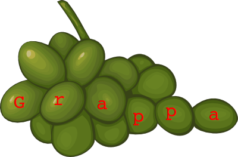

\[Original image courtesy of [clipartbest.com](http://www.clipartbest.com/clipart-Kin5EMyiq)\]

## What this is

This package allows you to write grammars (more precisely, parsing expression grammars, or
[PEG](http://en.wikipedia.org/wiki/Parsing_expression_grammar) for short) entirely in Java. Unlike,
for instance, ANTLR and JavaCC, parsers written with this package do **not** require a
pre-processing phase. Yes, this means you generate your parsers at _runtime_. And there is no DSL.
Pure Java!

License is Apache 2.0. See [here](https://github.com/parboiled1/project-info) for further
information.

This project has two dedicated Google groups:
[grappa-users](http://groups.google.com/d/forum/grappa-users) and
[grappa-devel](http://groups.google.com/d/forum/grappa-devel). They are also available to post by
email.

## Motivation

This is a fork of the original [parboiled](https://github.com/sirthias/parboiled). Its author,
[Matthias Doenitz](https://github.com/sirthias), has since left the Java world for the Scala world
(with [parboiled2](https://github.com/sirthias/parboiled2)).

But parboiled does not deserve to be left stranded, nor its users. It is just
too good. No other package allows you to write grammars entirely in Java... And
what is more, it performs really well. This package is therefore dedicated to
continuing its development.

Grappa requires Java 6 or later.

### And, uh, the name?

Well, you write <i>gra</i>mmars and can then generate <i>pa</i>rsers for them. (I also happen to
like the [drink of the same name](http://www.istitutograppa.org/))

## Versions

The current version is **1.0.0-beta.3**. See the [release notes](RELEASE-NOTES.md) for details.

The major new features compared to parboiled1 are:

* more basic rules: all rules defined by [RFC 5234, Appendix B,
  section1](https://tools.ietf.org/html/rfc5234#appendix-B.1) are now available by default (except
  for `LWSP`);
* Unicode support: rules for matching a single code point or a range of code points;
* Java 8 compatibility;
* `CharSequence` support for input buffers, which means you can use grappa on very large files using
  [largetext](https://github.com/fge/largetext);
* no Scala support anymore;
* build system has been switched from sbt to [gradle](http://gradle.org);
* generated bytecode is now 1.6 (was 1.5);
* possibility to obtain the bytecode of a generated parser;
* one bug fixed (see [here](https://github.com/parboiled1/parboiled-core/issues/1)).

And many other things; see the [release notes](RELEASE-NOTES.md) for more details.

To add it to your projects:

```
# with gradle:
dependencies {
    compile(group: "com.github.parboiled1", name: "grappa", version: "1.0.0-beta.1");
}

# with maven:
<dependency>
    <groupId>com.github.parboiled1</groupId>
    <artifactId>grappa</artifactId>
    <version>1.0.0-beta.1</version>
</dependency>
```

## Example grammars

You can have a first taste by looking at the [examples
package](https://github.com/parboiled1/parboiled-examples). Here is a very simple grammar to match
double quoted strings and does nothing else (you can, of course, do [much
more](https://github.com/parboiled1/parboiled/wiki)):

```java
@BuildParseTree
public class DoubleQuotedString
    extends BaseParser<Void>
{
    Rule normal()
    {
        return noneOf("\\\"");
    }

    Rule special()
    {
        return string("\\\"");
    }

    Rule nsn() // normal* (special normal*)*
    {
        return sequence(
            zeroOrMore(normal()),
            zeroOrMore(special(), zeroOrMore(normal()))
        );
    }

    Rule mainRule()
    {
        return sequence('"', nsn(), '"', EOI);
    }
}
```

## How to build

You will need a JDK 6 or greater use this command to build and install into your local repository:

```
# Unix systems: Linux, MacOSX, *BSD
./gradlew clean test install
# Windows systems
gradlew.bat clean test install
```

